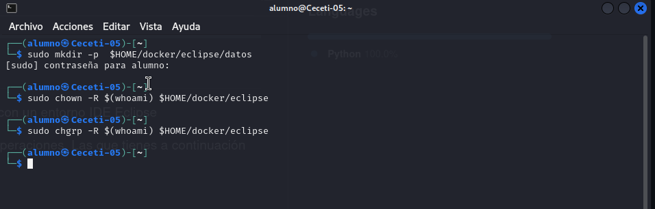
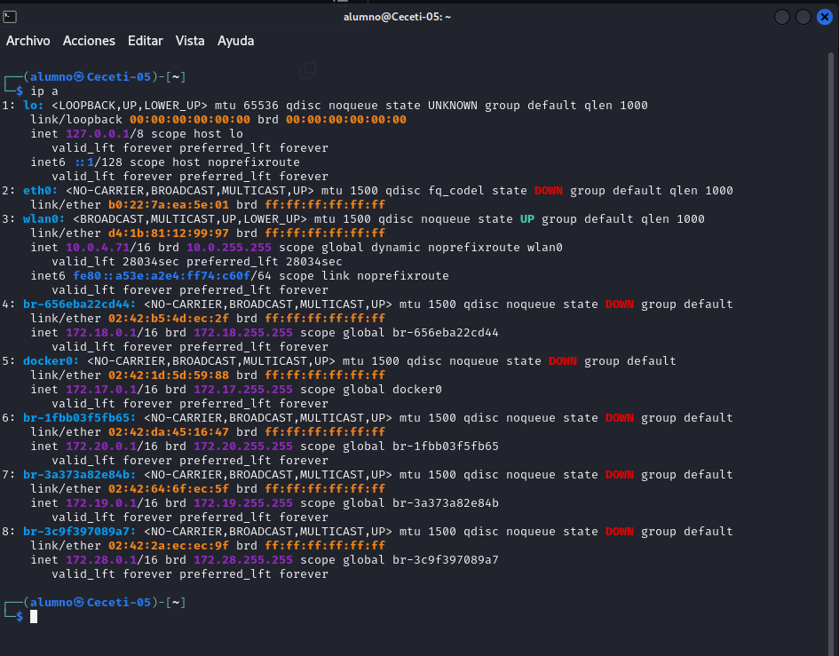
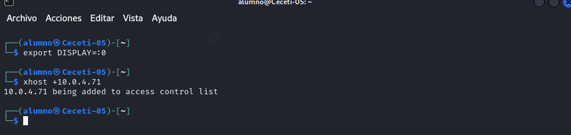
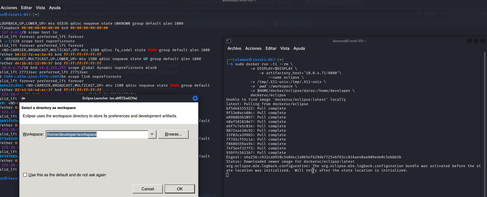
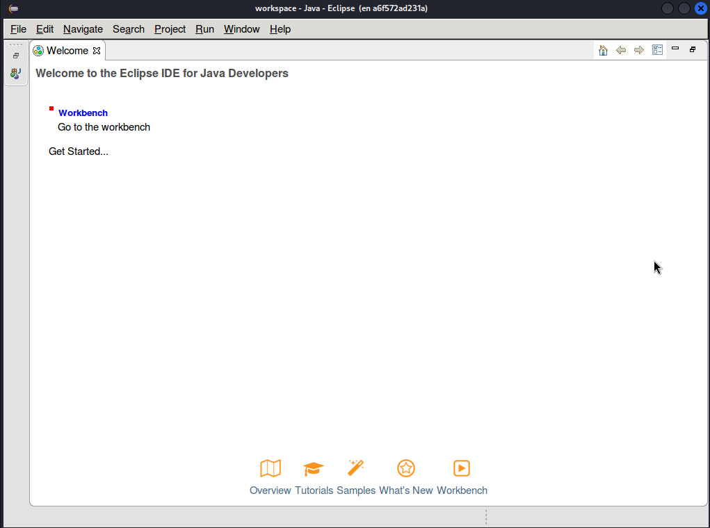

# Creacion y lanzmiento de Eclipse

En [este enlace](https://hub.docker.com/r/dockeruc/eclipse) puedes encontrar podemos crear un contenedor docker con un entorno IDE Eclipse

Seguimos los pasos y hacemos las capturas necesarias:

1. Crear las carpetas necesarias:

2. Configurar el entorno gráfico:

Vemos nuestra ip

Configuramos el entorno

3. Lanzar el contenedor:

Lanzamos el contenedor

Vemos eclipse lanzado

> __Explica el comando docker que has utilizado__

Se crean los directorios necesarios con mkdir -p $HOME/docker/eclipse/datos, 
asegurándose de incluir todos los subdirectorios requeridos. 
Luego, se asigna al usuario actual la propiedad de dichos directorios y 
sus contenidos con chown -R $(whoami) $HOME/docker/eclipse, 
y también se cambia el grupo al del usuario actual usando chgrp -R $(whoami) $HOME/docker/eclipse. Estos pasos garantizan que el usuario tenga control total sobre los directorios, algo esencial al compartirlos con contenedores Docker o al gestionar archivos de forma segura.