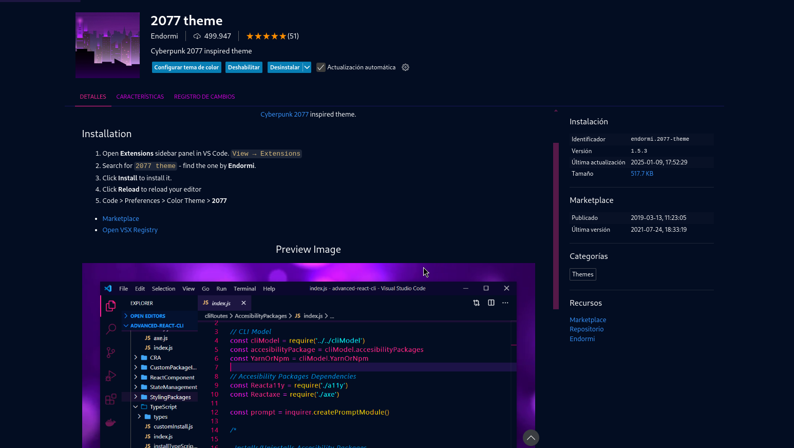
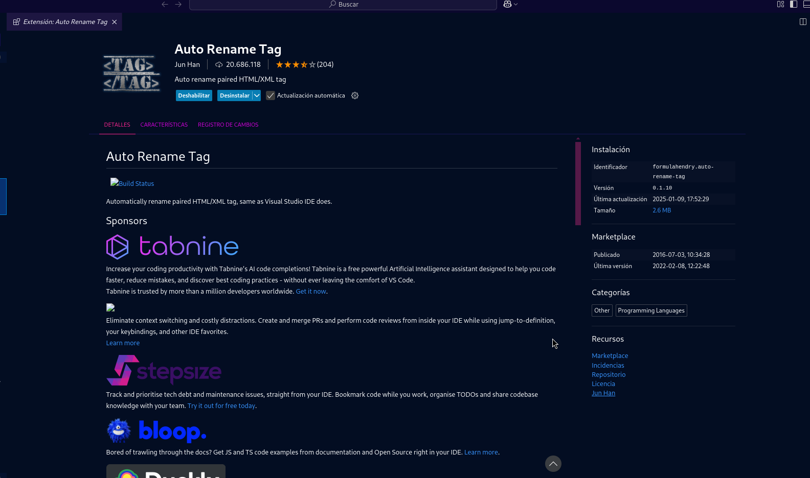
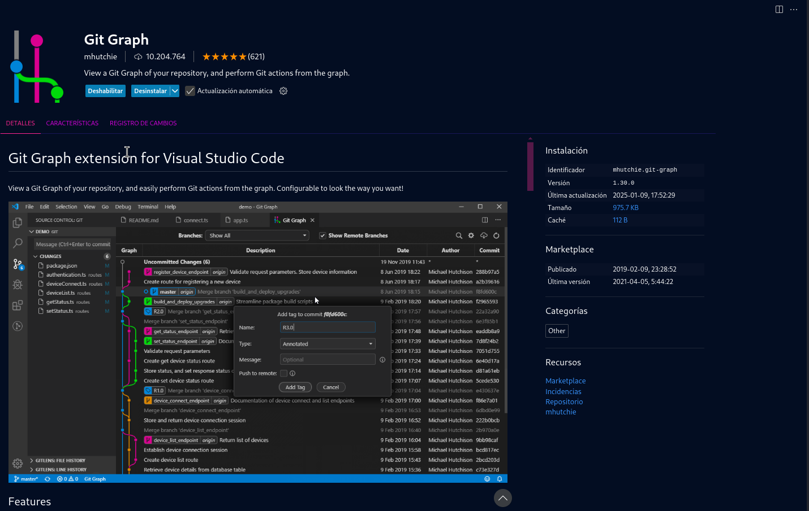
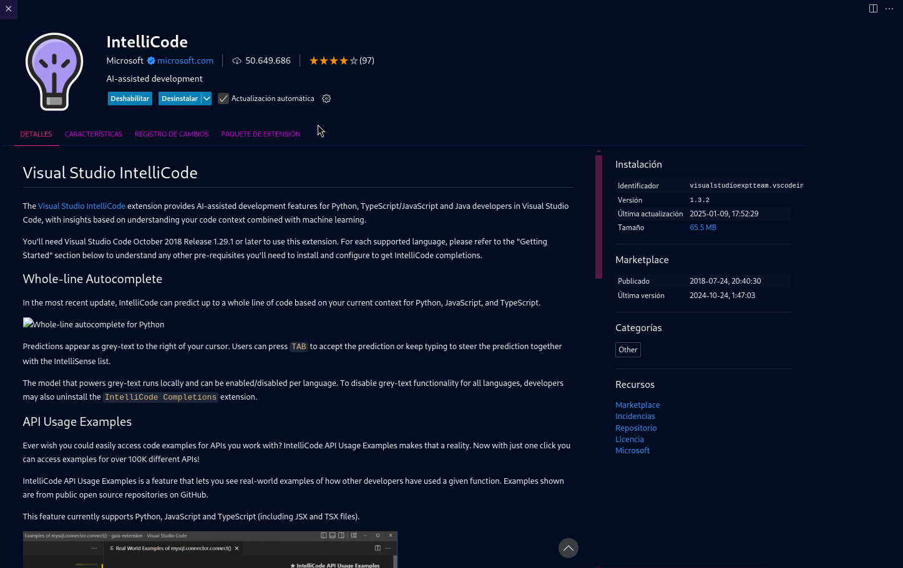
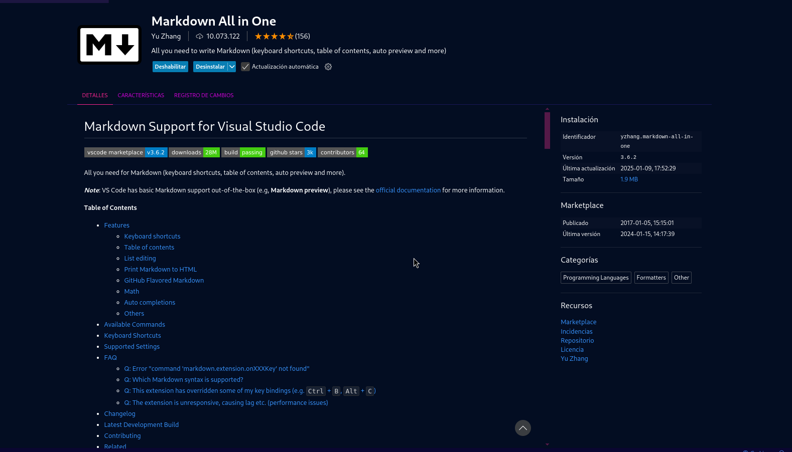
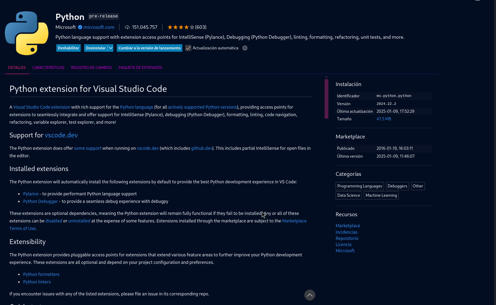
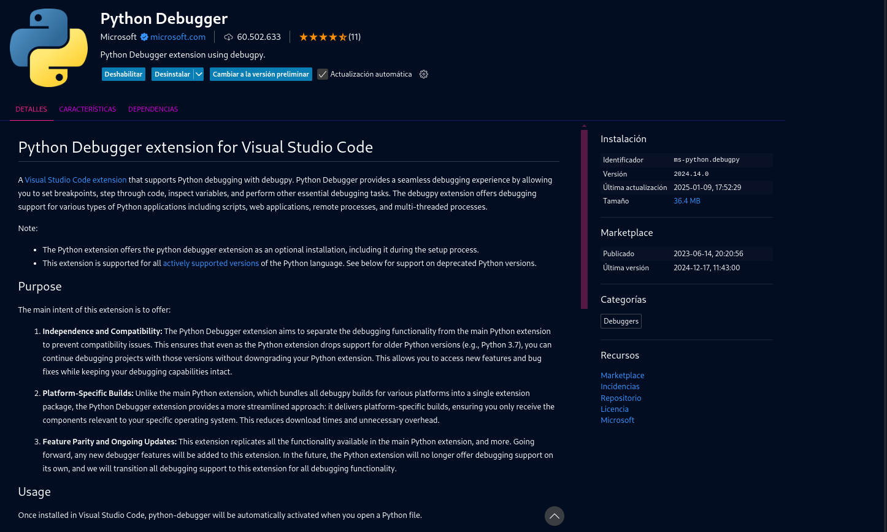
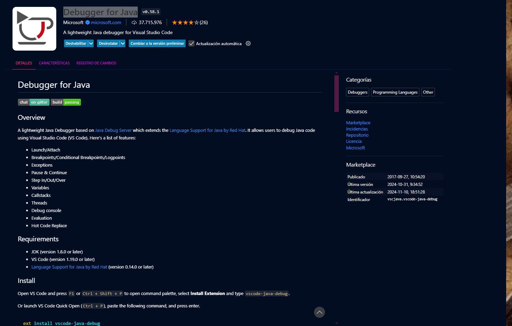
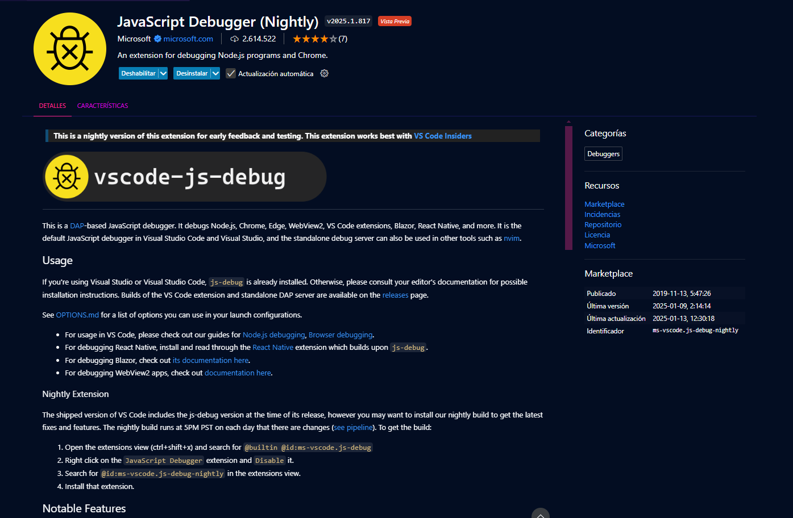

# Instalar extensiones

Debido a que vamos a trabajar con Visual Code, todos los pasos requeridos en el ejercicio serán tratados para dicho programa.

Las extensiones de un IDE nos van a facilitar la labor de programar, hacer más flexible nuestro IDE, además de hacer nuestros código más seguro.
Tenemos muchas extensiones, tanto para lenguajes de programación específicos como para el IDE.

1.- Busca cuáles son las mejores extensiones de Visual Code para programadores y las añades desde la tienda de tu IDE.

### 2077 theme

Particularmente es un plugin que me ayuda a difernciar comandos y visualmente me hace el entorno agradable.
La mayoria de programadores usan estos tipos de plugins para crear entornos amigables.

### Auto Rename Tag

Auto Rename Tag te permite cambiar el nombre de una etiqueta HTML y automáticamente renombrará su pareja de cierre.
Muy utilizado por programadores de html.

### Git Graph

El comando git log graph crea una descripción gráfica de cómo se han ramificado y fusionado con el tiempo los distintos procesos de desarrollo de un desarrollador.
Con este plugins lo veremos directamente de un vistazo visual sin necesidad de llamar al comando.

### IntelliCode

Inteligencia artificial aplicada a Visual Code. Muy interesante y utilizada su version gratuita.

### Markdown All in One

Plugin que nos ayudará a dar formato a nuestros archivos .md

### Python

El plugin por excelencia y el mas usado en el entorno. Nos permite él y todos sus agregados a usar y crear archivos de python.
Las mas de 150 millones de descargas no necesitan mas presentación.

Con el vemos tambien su debuguer, el cual nos va a ayudar a corregir esos programas que carguemos o hagamos.

2.- Busca y escribe para qué sirven estos plugins: Checkstyle, Sonar Lint.

- Checkstyle:
  
  Checkstyle​ es una herramienta de análisis de código estático que se utiliza en el desarrollo de software para comprobar si el código fuente de Java cumple con las reglas de codificación.

  Desarrollado originalmente por Oliver Burn en 2001, el proyecto es mantenido por un equipo de desarrolladores de todo el mundo.

  La versión estable actual es la 8.342​ que está basada en el lenguaje Java 8.
  
  

- Sonar Lint:

    Es un plugin IDE libre y de código abierto que ayuda a los desarrolladores a encontrar y solucionar errores en tiempo real mientras escriben código.

    

3.- Instala los plugins y complementos que has encontrado. Además busca e instala los plugins Checkstyle y Sonar Lint.

Debido a que Checkstyle y Sonar Lint son mas propios para un IDE como eclipse y yo estoy utilizando VCode, he decidido instalar otros que me podrán ayudar para entornos de
desarrollo java o html.

