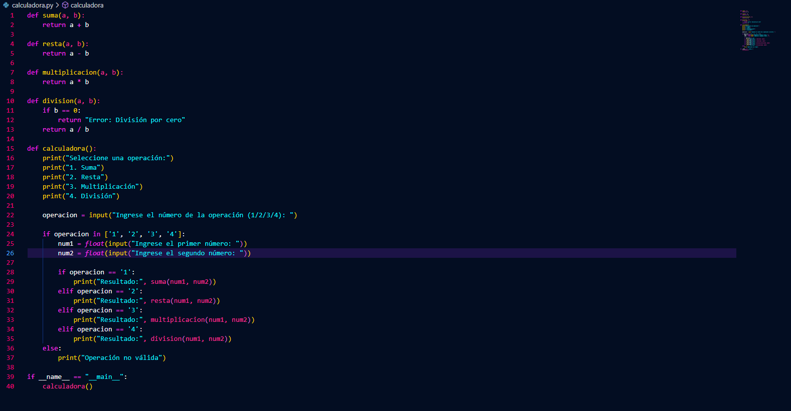
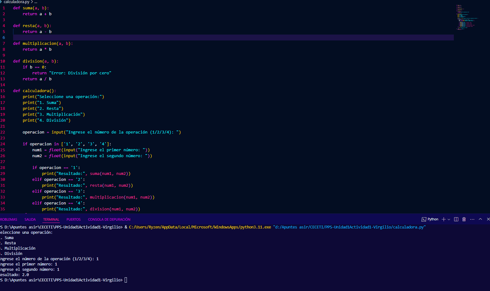
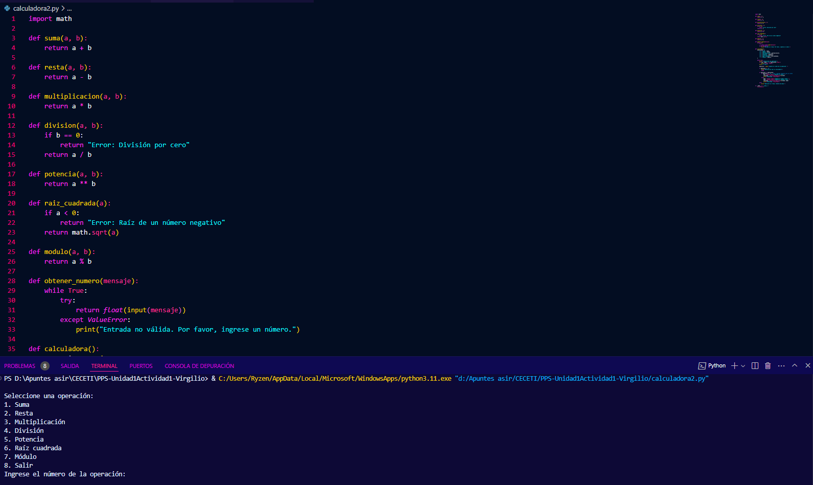

# Prueba entornos
El entorno de desarrollo nos sirve para crear nuestras aplicaciones y además podemos comprobar los errores que tienen, problemas de seguridad, etc. por lo que desde allí vamos a poder corregirlos.

Descarga el código fuente de un proyecto java o python: compila, enlaza y ejecutaló. 
Tienes algunos ejemplos en la carpeta Sources de este repositorio Utiliza las herramientas de depuración de Eclipse o Netbeans para depurar el proyecto, y las diferentes extensiones para ver información, problemas, etc.

El código es una calculadora simple implementada en Python. 
La calculadora permite al usuario seleccionar una operación (suma, resta, multiplicación o división) y proporciona el resultado basado en los números ingresados.

Ejecutamos el programa y vemos si tiene errores.

### Sugerencias de mejora:

Validación de entradas:

Se podría validar si los valores ingresados para los números son realmente números y manejar errores si el usuario ingresa texto no válido.
De igual manera se podría validar si la división es correcta. No podemos dividir por 0.

Después de completar una operación, se podría permitir al usuario realizar otra sin reiniciar el programa.

Añadir más operaciones:

Incluir funciones como potencia, raíz cuadrada, o módulo.

Refactorización del menú:

Usar un diccionario para mapear las operaciones a sus respectivas funciones, reduciendo la necesidad de múltiples bloques if-elif.

